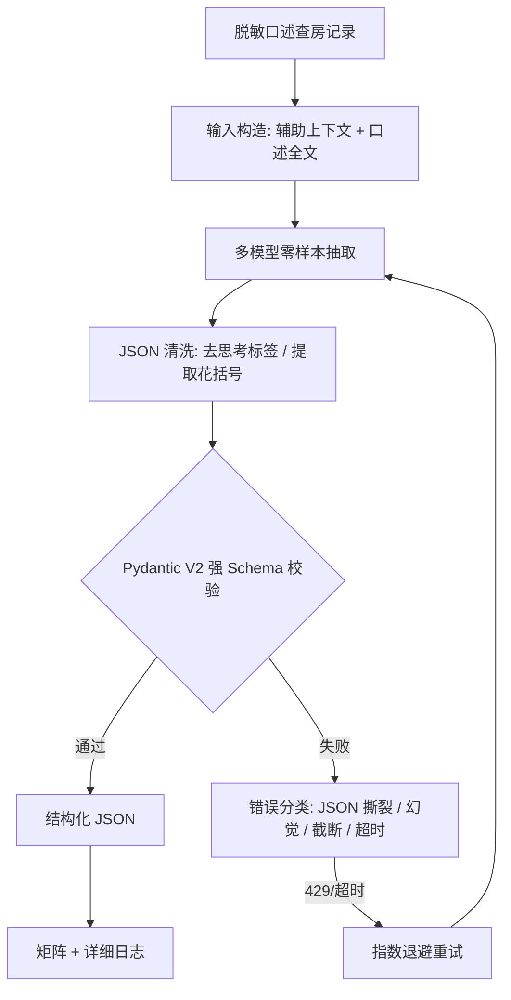

# Complex-IE-Bench：面向深层嵌套 JSON 的大模型信息抽取评测

[](https://www.python.org/)
[](https://opensource.org/licenses/MIT)
[](https://docs.pydantic.dev/)

**Complex-IE-Bench** 是一个评测大模型在**高度口语化、多意图、强 Schema 的非结构化文本**上，能否稳定输出**深层嵌套结构化 JSON** 的评测框架。当前以**医疗口述查房记录**为场景（医疗与金融类似，数据敏感、容错率低、字段强约束），对 9 个主流大模型做零样本（zero-shot）抽取与横向对比。

## 一、为什么做这个

主流 Benchmark（MMLU、GSM8K 等）聚焦选择题与简单推理。但在真实产业落地中，更难的问题是：

> 如何从一段口语随意、长短句交织、信息密集的文本（医生查房口述、金融交易 IM）中，**稳定地**抽出符合严格 Schema、带深层嵌套数组（如多张用药医嘱）的结构化结果？

模型的能力差异，恰恰体现在这些"最后一公里"上：会不会漏字段、会不会编造（幻觉）、长 JSON 会不会截断或撕裂、不同厂商 API 的参数差异如何适配。

## 二、核心特性

- **Pydantic V2 强类型 Schema 装甲**：11 个信息模块、含 `medication_orders` 深层嵌套；`extra='forbid'` 在结构层拒绝模型多输出的字段（防幻觉）。
- **多模型矩阵评测**：Qwen（通义）、DeepSeek、GLM（智谱）、Kimi（Moonshot）共 9 个模型，零样本抽取。
- **工程化容错**：思考标签清理、花括号提取、429 指数退避重试、超时熔断、断点续传、逐记录落盘。
- **异构模型自动适配**：自动识别 reasoning 模型（R1 / Kimi）并调整 `max_tokens`、超时；适配 Kimi 仅允许 `temperature=1` 等厂商差异。
- **可复现**：脚本使用基于文件位置的相对路径，clone 后配置 Key 即可运行，不依赖作者本机环境。

## 三、评测流程



## 四、评测结果（50 条脱敏病历）

**评分口径**：模型输出经清洗后通过 Pydantic Schema 校验（结构完整、字段合法、无多余字段）记 1，否则记 0。该指标为**结构合规率**。

| 模型 | 厂商 | 结构合规率 | 平均延迟 |
|---|---|---|---|
| deepseek-v3 | 深度求索 | **94%** | 22s |
| qwen-max | 阿里 | **94%** | 29s |
| qwen-turbo | 阿里 | **92%** | 12s |
| kimi-k2.6 | 月之暗面 | 86% | 89s |
| deepseek-r1 | 深度求索 | 82% | 94s |
| qwen-plus | 阿里 | 74% | 130s |
| glm-4-air | 智谱 | 54% | 17s |
| glm-4-plus | 智谱 |52% | 18s |
| glm-4-flash | 智谱 | 46% | 324s |

**关键发现：**
- 第一梯队（deepseek-v3 / qwen-max / qwen-turbo）在深嵌套医嘱抽取上稳定达到 92%+；强弱模型之间差距接近 48 个百分点。
- 小模型（glm-4-flash）主要在 `medication_orders` 深层嵌套、长文本上失败。
- Reasoning 模型（R1、Kimi）需要为内部思考预留大量输出额度，否则正式 JSON 还未生成就被截断——这是配置中真实踩到的坑。

## 五、失败模式分析（500 次请求）

| 失败类型 | 典型现象 | 应对 |
|---|---|---|
| JSON 结构撕裂 | 长 JSON 漏逗号、`Extra data` | 清洗 + 重试 |
| Token 截断 | 思考占满额度，`finish_reason=length` | 识别 reasoning 模型并提升上限 |
| Schema 幻觉 | 输出 Schema 未定义的字段 | `extra='forbid'` 拦截 |
| 限流 / 超时 | 429、网关并发上限 | 指数退避、串行化、熔断 |
| 内容过滤 | 敏感输入触发拦截 | 记录并人工处理 |

## 六、快速开始

```bash
# 1. 安装依赖
pip install -r requirements.txt

# 2. 配置 Key
cp .env.example .env   # 编辑 .env，至少填入一个可用的 API Key

# 3. 运行完整评测（9 模型 × 50 条）
python phase1.py

# 或仅补跑某个模型（示例 Kimi，串行）
python run_kimi.py

# 从详细日志重建矩阵
python rebuild_matrix.py
```

## 七、项目结构

```text
Complex-IE-Bench/
├── phase1.py              # 核心：Pydantic Schema + 抽取器 + 评测矩阵
├── run_kimi.py            # 单模型补跑（串行 / 断点续传）
├── rebuild_matrix.py      # 从详细日志重建矩阵
├── docs/
│   └── L0_Schema_Spec_V3.md   # L0 抽取 Schema 规范
├── data/
│   └── medical_rounds_50.xlsx # 50 条脱敏病历
├── output_eval/
│   ├── Phase1_01_Matrix.csv  # 模型×病历 结果矩阵
│   ├── kimi_results.csv      # 单模型补跑结果
│   └── Phase1_Detailed_Logs.csv  # 逐请求详细日志
├── requirements.txt
├── .env.example
└── LICENSE
```

## 八、合规与边界声明

- 仓库内数据均为**脱敏数据**，已去除患者姓名、住院号、身份证号等可识别信息。
- 当前指标为**结构合规率**，不等于字段级语义准确率；通过 Schema 的结果仍可能存在语义偏差。
- 本项目定位为**辅助 / 初稿工具**，不用于自主临床决策；真实落地应采用「**人在回路 + 关键字段强制人工审核 + 全程可追溯**」，并需通过相应的医疗器械合规认证。

## 九、Roadmap

- [ ] 字段级语义评测（实体 / 关系 F1），而非仅结构合规率
- [ ] 引入 RAG 临床指南做剂量、禁忌交叉校验
- [ ] 封装为 FastAPI 本地服务 + Web 界面
- [ ] 支持 Ollama 加载本地开源模型，实现完全离线
